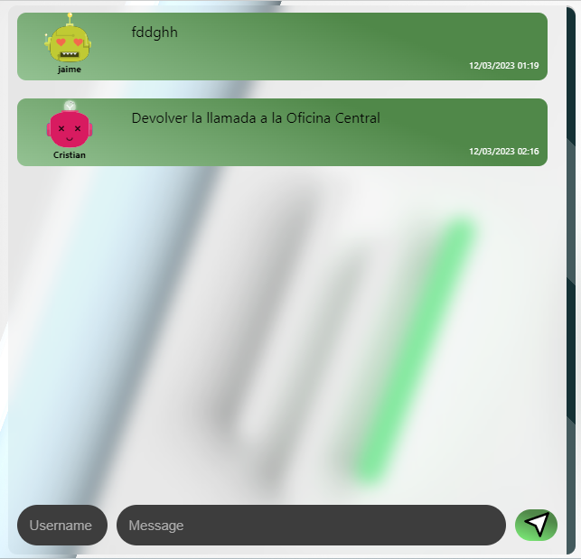

# Mensajería Chat Express - Versión Web 

La aplicación es un práctico sistema de mensajería interna para una pequeña empresa

---

## Cuál es el stack tecnológico que utilizamos?

- **Librería ReactJS**
- **Supabase: plataforma que está basada en PostgreSQL**
- **Lenguaje base de programación: Javascript**
- **Aplicación de estilos al proyecto: CSS**

---

### Vista previa de la solución:

#### Esta es la captura del Chat y sus mensajes👇👇:

Allí se puede observar el **Username** y el **Message** -- Como punto de ingreso para nuevos mensaje

Los íconos del mensaje **son generados automáticamente** de acuerdo al nombre de usuario ingresado

---

#### Información adicional:

- Usted puede enviar y recibir mensajes de cualquiera;
- Su ícono de Avatar es generado automáticamente;
- Su nombre es almacenado y recordado al momento de ingresar;

# Entorno de ejecución

Después de descargarlos usted puede instalar las dependencias con:

`npm install`

*Si usted no tiene el **vite** instalado!*

`npm create vite@latest`

Y luego lo corre con:

`npm start`

### Aplicación sujeta a actualizaciones de código y herramientas asociadas a su desarrollo.
